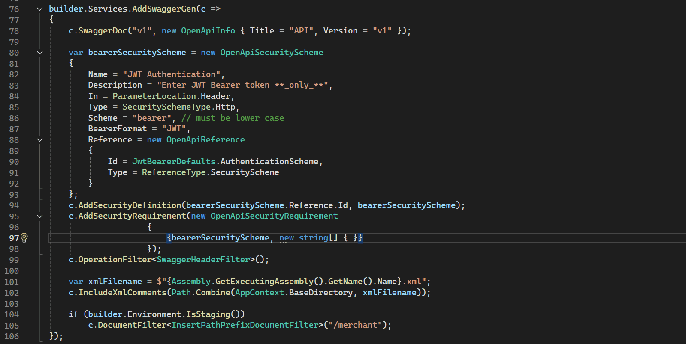

# Quick Blame

Quick Blame is a simple to use extension for Visual Studio 2022. It is insipired by the Quick Blame feature from the GitLens Extension in Visual Studio Code.
Quick Blame allows you to blame any line of code in your repo simply by clicking the line endings (any point after the last character of the line). You also get to see more details by hovering on the displayed summary.

## Usage

## License

[MIT](VSGitBlame/Resources/LICENSE)
